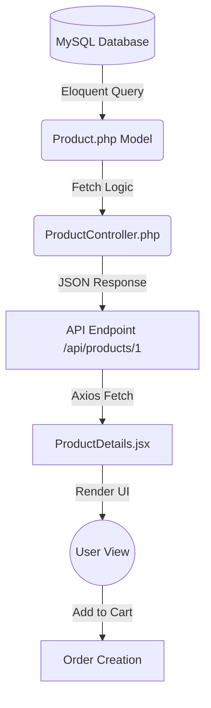

# Product Data Flow Roadmap 🚀

### 🟢 1. Database Layer (The Source)
- **Table:** `products`
- **Fields:** `id`, `name`, `price`, `stock`, `images` (stored as JSON), etc.
- **SQL:** Stores the raw data.

---

### 🟡 2. Backend Model Layer ([Product.php](file:///c:/Users/Admin/Downloads/E-commerce-FullStack/13.1.26-backend/app/Models/Product.php))
- **Role:** Translates DB data into PHP objects.
- **Casts:** Converts `price` to float, `stock` to integer.
- **Accessors:** Joins the storage path to the image name to create a full URL.

---

### 🟠 3. Backend Controller & API Layer ([ProductController.php](file:///c:/Users/Admin/Downloads/E-commerce-FullStack/13.1.26-backend/app/Http/Controllers/ProductController.php))
- **Route:** `GET /api/products/{id}` in `api.php`.
- **Logic:** Controller fetches the product via Eloquent and returns it as JSON.
- **JSON Structure:** `{ "id": 1, "name": "Jeans", "price": 99.99, "image": ["http://.../img.jpg"] }`

---

### 🔵 4. Frontend Component Layer ([ProductDetails.jsx](file:///c:/Users/Admin/Downloads/E-commerce-FullStack/13.1.26Frontend/src/pages/ProductDetails.jsx))
- **Fetch:** Uses `axios.get()` inside `useEffect` to call the API.
- **State:** Stores the JSON data in a `useState(null)` variable.
- **UI:** Renders the data using Tailwind/CSS classes.

---

### 🔴 5. Action Layer (Cart & Order)
- **Process:** When user clicks "Add to Cart", the `product_id` and `quantity` are saved.
- **Checkout:** Hits `POST /api/orders` where the `Product` is locked for stock update.

---

